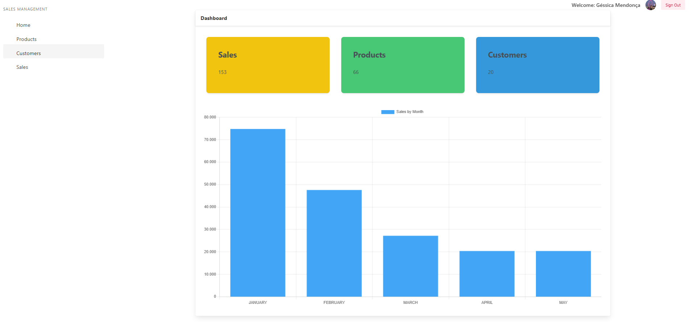
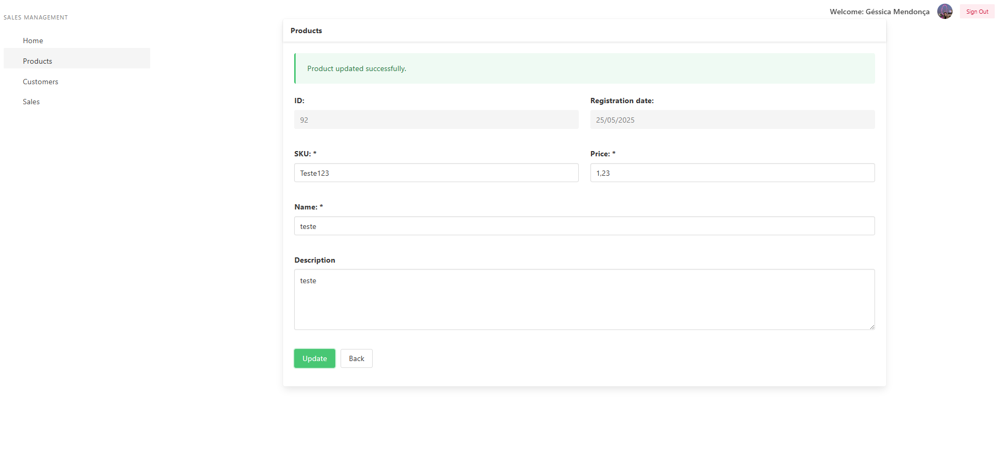
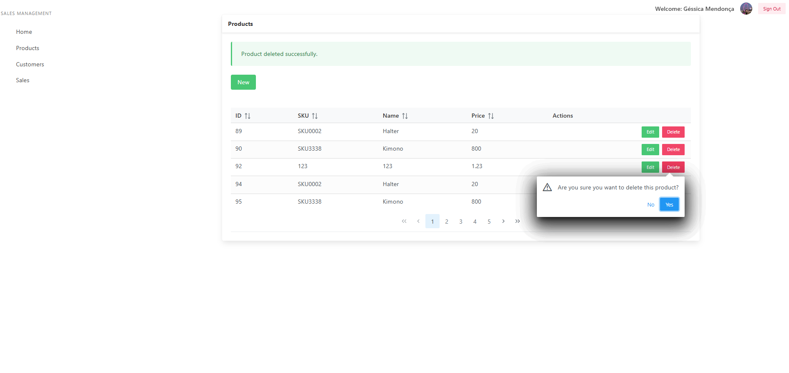
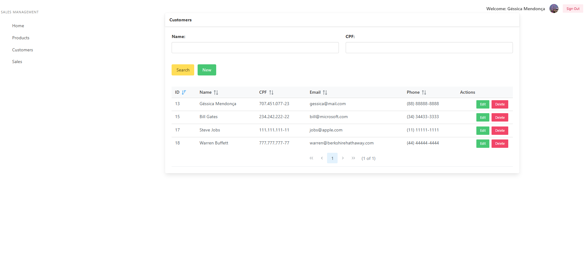

<h1 align="center">📊 Sales Management</h1>

<p align="center">
  Full-stack web application for managing products, customers, and sales, with real-time dashboards and third-party authentication.
</p>

<p align="center">
  
</p>

---

## 🚀 Features

- 🧾 Product registration  
- 👥 Client registration  
- 💰 Sales registration  
- 📊 Dashboard overview:
  - Total products
  - Total customers
  - Total sales
  - Monthly sales chart
- 🔐 Login with GitHub, Google, and Auth0  
- 🔓 Logout

---

## 🛠️ Technologies

**Frontend:**  
- React (Next.js)
- Bulma CSS
- PrimeReact
- Formik + Yup
- Chart.js
- Axios

**Backend:**  
- Spring Boot
- Spring Data JPA
- Spring Security

**Auth:**  
- NextAuth (GitHub, Google, Auth0)

---

## ⚙️ Getting Started

### Prerequisites

- Node.js (v18+)
- Java 17+
- Maven
- PostgreSQL or MySQL

### Backend

```bash
cd backend
./mvnw spring-boot:run
```

> Or run directly in IntelliJ by right-clicking the application class.

### Frontend

```bash
cd frontend
yarn install
yarn dev
```

The app will be available at: [http://localhost:3000](http://localhost:3000)

---

## 📸 Screenshots

### 📊 Dashboard


### 🧾 Products




### 👥 Customers 


### 💰 Sales Registration


---

<p align="center">
  Made with ❤️ by <a href="https://github.com/gmgessicamayara">Gessica Mendonça</a>
</p>
